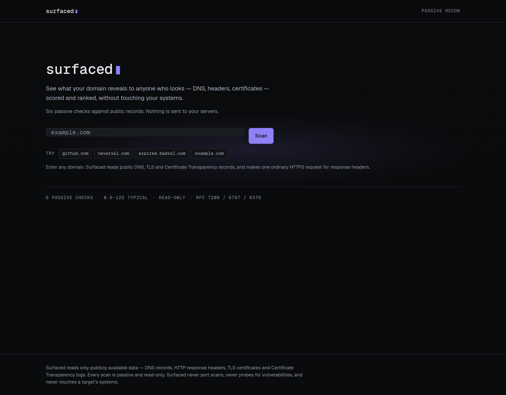
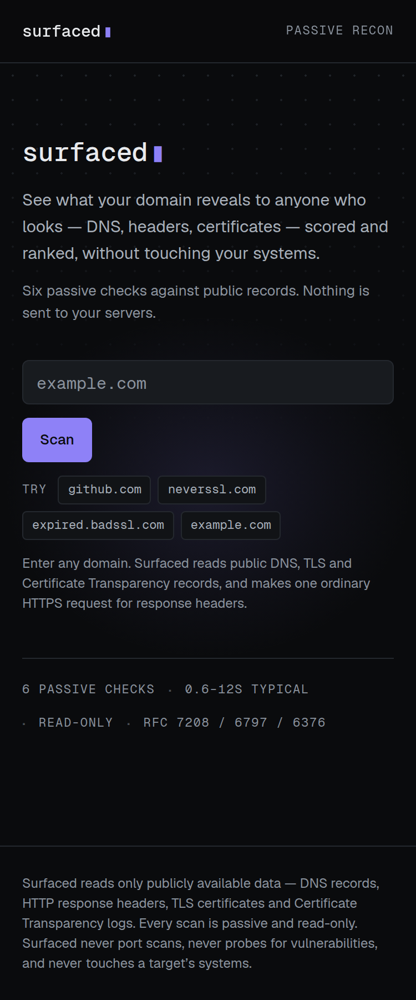
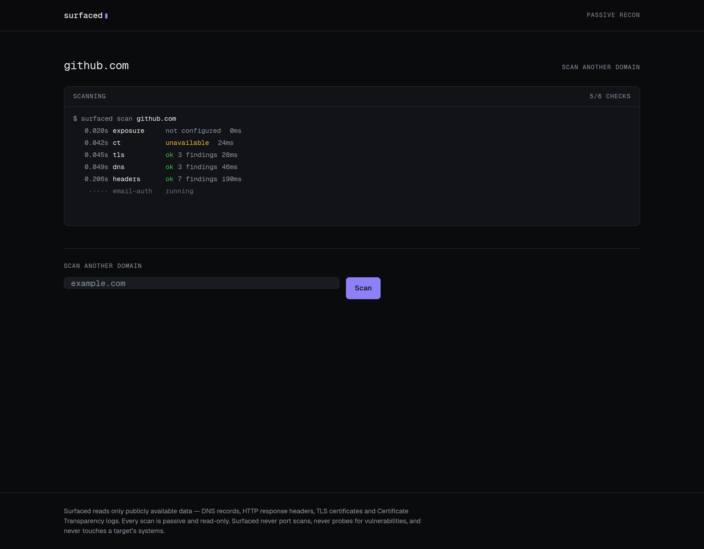
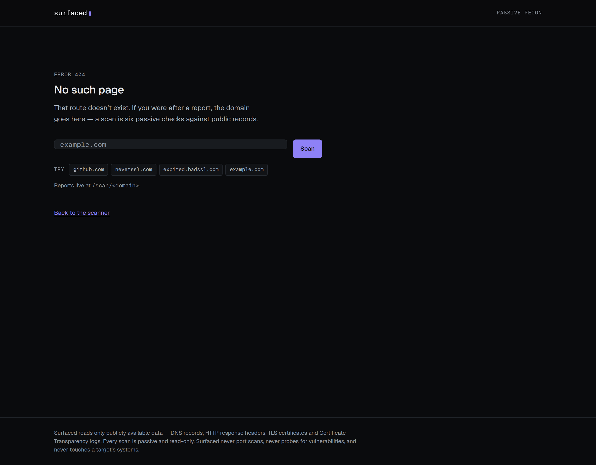

# Surfaced

Surfaced reads what a company's domain already tells the public — DNS records,
HTTP response headers, TLS certificates, Certificate Transparency logs — and
returns a scored report with the findings ranked by how much they matter. You
type a domain; you get back what an attacker would see before they did
anything at all.

---

## It is passive, and that is the point

**Surfaced never touches the target's systems beyond a single ordinary HTTPS
request** — the same one your browser makes when you visit the site, at normal
volume, identifying itself honestly. Everything else it knows comes from public
records that anyone can query without permission.

This is the constraint the whole design is built around, because it is what
makes the tool legal to point at a domain nobody asked you to test. It is not a
phase or a default. The scanner does not contain, and will not be given:

- port scanning of any kind
- vulnerability probing, fuzzing, or payload injection
- authentication attempts, credential testing, or brute forcing
- directory, path, or subdomain brute forcing
- request volume capable of degrading anything
- any request pattern designed to evade rate limiting or detection

If a feature can't be satisfied from public records, Surfaced doesn't do it —
not behind a flag, not behind an "I own this domain" checkbox. Self-attestation
is not verification, and an unticked box is not consent.

### The corollary: never report a guess as a fact

A scanner that returns plausible-looking wrong answers is worse than no
scanner, because people act on it. So a check that cannot reach its data source
reports `error` and is **excluded from the score** — it never degrades into a
clean result.

That principle shows up as specific, hard-won behaviour:

- **No DKIM key at the selectors we probed is not "DKIM is missing."** Selectors
  are not enumerable from DNS. Absence proves nothing, and the finding says so.
- **A subdomain with no DMARC record of its own is not unprotected.** DMARC
  falls back to the organizational domain, with `sp=` taking precedence over
  `p=` (RFC 7489 §6.6.3). The check reads the parent before it reports.
- **An empty `p=` in a DKIM record is a revoked key** (RFC 6376 §3.6.1), not a
  published one.
- **Headers are graded only from a successful response.** A WAF's 403 or a 404
  page routinely lacks the headers the real site sends; grading one would
  produce a page of confident, false findings.
- **A failed DNSSEC lookup is not "unsigned."** It is an unanswered question.
- **A subdomain with no NS records is normally delegated, not broken.**

Each of those was a real bug, caught in verification, that would have shipped a
confident wrong answer.

---

## The six checks

| Check | Reads |
|---|---|
| **Email authentication** | SPF (including recursive `include:` expansion and the RFC 7208 ten-lookup limit), DKIM at a list of common selectors, DMARC with organizational-domain fallback |
| **DNS** | Nameserver delegation and provider diversity, MX records including RFC 7505 null MX, SOA, and DNSSEC DS records over DNS-over-HTTPS |
| **HTTP headers** | One HEAD (falling back to GET) to the site's front door: HSTS, CSP, X-Frame-Options, X-Content-Type-Options, Referrer-Policy, Permissions-Policy, version disclosure, and whether `http://` redirects to `https://` |
| **TLS** | One handshake on 443, read for protocol version, cipher, validity window, hostname coverage, chain trust, key size and signature algorithm |
| **Certificate Transparency** | crt.sh, for every hostname the domain has published a certificate for — and which of those look like non-production or administrative systems |
| **Breach exposure** | Have I Been Pwned's domain search, when an API key is configured. Without one it reports `not_configured`, which is **not** a pass |

---

## How the score works

Each check carries a weight (`lib/scanner/score.ts`). Findings deduct a
fraction of their check's weight by severity, capped so one very broken area
can't swamp everything else. The result is 0–100.

The part that matters is the denominator:

> **A check that could not run is removed from the denominator, not scored.**

Scoring an unavailable check as a pass would flatter the domain for work that
never happened. Scoring it as a failure would punish the domain because crt.sh
was down — which is not a fact about the domain at all. So it is excluded, and
the report says so in three places: the score is marked partial, a callout
names each excluded check with the verbatim reason, and that check's axis on
the radar renders as an explicit gap rather than a zero.

A 92 from five checks is not a 92 from six, and the UI is not allowed to let
you mistake one for the other.

---

## Architecture

```
lib/scanner/
  types.ts          CheckResult, Finding, ScanReport — one shape for everything
  validate.ts       the SSRF boundary (see below)
  orchestrate.ts    runs the six checks, assembles the report
  score.ts          weights, deductions, per-axis subscores
  <check>.ts        one module per check
  internal/         DNS resolver, DoH, HTTP fetcher, timeouts
```

**Every check is the same shape and fails the same way.** A check returns a
`CheckResult` with a status of `ok`, `error` or `not_configured`; the
orchestrator runs all six concurrently and converts any throw into an `error`
result. One slow dependency degrades one section of the report rather than
failing the scan.

**Results stream.** `scanHostnameStream()` is an async generator that emits an
event the moment each check settles, and `scanHostname()` is implemented by
draining it — one code path, so the live log and the final report can never
disagree. `POST /api/scan` is content-negotiated: `Accept: text/event-stream`
gets Server-Sent Events, anything else gets the single JSON report. The UI's
scan log is printed from those real events, with measured timings; nothing is
paced by a timer.

**`validate.ts` is the SSRF boundary.** Every scan target passes through it
before any module touches the network: public-suffix validation via `tldts`,
rejection of IP literals, and rejection of anything that resolves into private,
loopback, link-local or otherwise reserved address space. The redirect-following
fetcher re-checks every hop, because a redirect is a second chance to be sent
somewhere private. `npm run verify:ssrf` exercises that boundary directly.

---

## Stack

Next.js 15 (App Router) · TypeScript `strict` with `noUncheckedIndexedAccess` ·
Tailwind CSS v4, configured entirely in `app/globals.css` · `geist` fonts from
npm so builds work offline · Supabase wired but unused · deployed on Vercel.

### Running it

```bash
npm install
npm run dev
```

No environment variables are required — and that is enforced, not hoped for:

```bash
env -i PATH=/usr/local/bin:/usr/bin:/bin HOME="$HOME" sh -c 'npm run build'
```

All three variables are optional. `HIBP_API_KEY` enables the breach check;
without it that check honestly reports that the question was not asked. The two
Supabase variables are unused for now.

### Checks

```bash
npm run typecheck        # tsc --noEmit
npm run lint             # eslint
npm run check:contrast   # every token pair against WCAG AA, computed not eyeballed
npm run verify:ssrf      # the SSRF boundary battery
npm run verify:ct        # the crt.sh retry, via an injected fetcher
npm run verify:report    # remediation snippets, score bands, filters, site URL
npm run verify:scanner   # drives POST /api/scan against a running server
```

`verify:report` takes an optional base URL, in which case it also asserts that
the scan stream really streams — that check events arrive spread across the
scan rather than flushed together at the end.

---

## Screenshots

### Home





### A scan in progress

Each line is printed because a check actually settled, with its measured
elapsed time. The sixth check here is still running.



### Not found



### The report

> **Not yet captured.** The report screenshots are missing on purpose rather
> than by oversight.
>
> They have to be taken on a network that does not intercept TLS. The CI
> container this project was built in runs behind an egress gateway that
> terminates TLS and presents its own certificate, so a report captured there
> shows the *gateway's* certificate in the TLS panel — correct behaviour by the
> scanner, and a misleading picture of the domain. Shipping one would be the
> exact failure this README spends its first section promising not to commit.
>
> To produce them, on an unintercepted network:
>
> ```bash
> npm run build && npm start &
> curl -s -X POST localhost:3000/api/scan \
>   -H 'content-type: application/json' \
>   -d '{"domain":"github.com"}' > github.json
>
> PLAYWRIGHT_PATH=/path/to/node_modules/playwright-core \
>   OUT_DIR=docs/screenshots \
>   node scripts/screenshot-report.mjs replay --from github.json
> ```
>
> `replay` intercepts the API call in the browser and serves the captured
> report, so the screenshot shows real scanner output. The app itself has no
> fixture path and never will.

---

## Licence

Not yet licensed.
